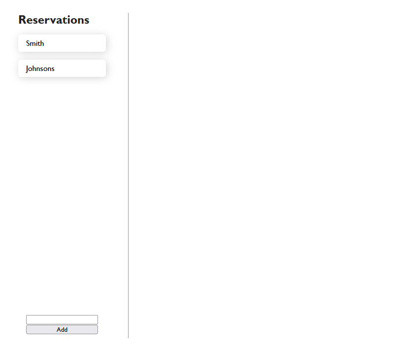
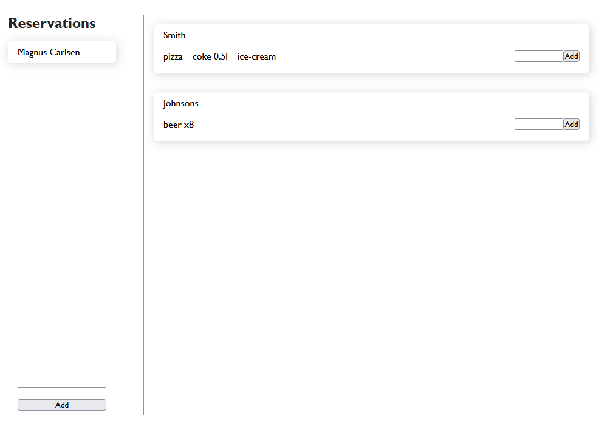

# restaurant-redux-toolkit
> Study project

Project was created just to practice Redux Toolkit that elegantly replaces more complicated Redux. Even in the [Redux official documentation](https://redux.js.org/introduction/getting-started) it is written that it's better to use Toolkit, so it is good to know how to use it.

## Table of contents
* [General info](#general-info)
* [Deployment](#deployment)
* [Screenshots](#screenshots)
* [Technologies](#technologies)
* [Setup](#setup)
* [Status](#status)
* [Inspiration](#inspiration)

## General info
Project allow a restaurant to:
* make reservations for customers
* add order for each of them

## Deployment
Thanks to Github Pages, I was able to easily deploy the application. You can see and test it yourself! \
[>> LINK TO DEPLOYED APP HERE <<](https://muzabol2.github.io/restaurant-redux-toolkit/)

## Screenshots
When added some reservations it will look like this:


After that click on a name and add order:


## Technologies
Main:
* React
* html, css

Libraries:
* react-redux
* @reduxjs/toolkit

## Setup
Copy repository on your machine. To download all needed dependencies (see package.json to know what they are) type in command line in the repo's location:
```bash
npm install
```
To run application on your local machine type: 
```bash
npm run start
```

## Status
Project is not perfect and there is lots that could be improved, but for me this project is finished. I just wanted to test this library a bit. If I forgot how to implement Redux Toolkit in the future, I will come back to this repo and copy parts of the code I need. :)

## Inspiration
Credits for:

[Laith Academy](https://www.youtube.com/@laithacademy) - for ideas and good [tutorials](https://youtu.be/jR4fagDcvrc). Thank you.

And, of course as always - StackOverflow... :)
