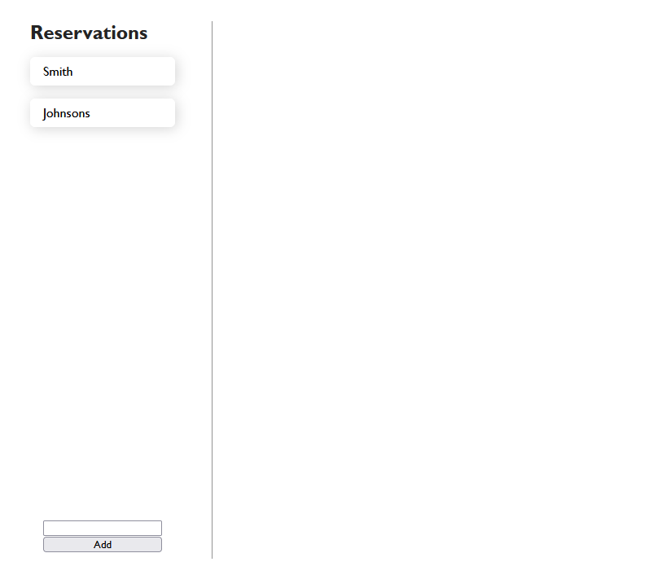
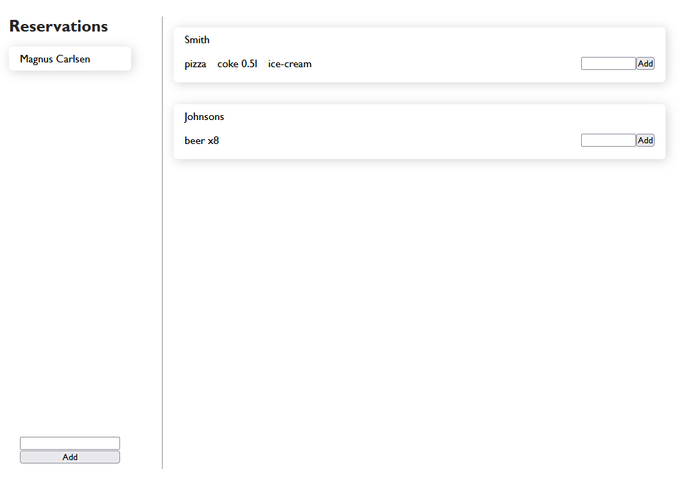

# restaurant-redux-toolkit
> Study project

Project was created just to practice Redux Toolkit that elegantly replaces more complicated Redux. Even in the [Redux official documentation](https://redux.js.org/introduction/getting-started) it is written that it's better to use Toolkit, so it is good to know how to use it.

## General info
Project allow a restaurant to:
* make reservations for customers
* add order for each of them

## Screenshots
When added some reservations it will look like this:

After that click on a name and add order:

## Inspiration
Credits for:
[Laith Academy](https://www.youtube.com/@laithacademy) - for ideas and good [tutorials](https://youtu.be/jR4fagDcvrc). Thank you.

And, of course as always - StackOverflow... :)
